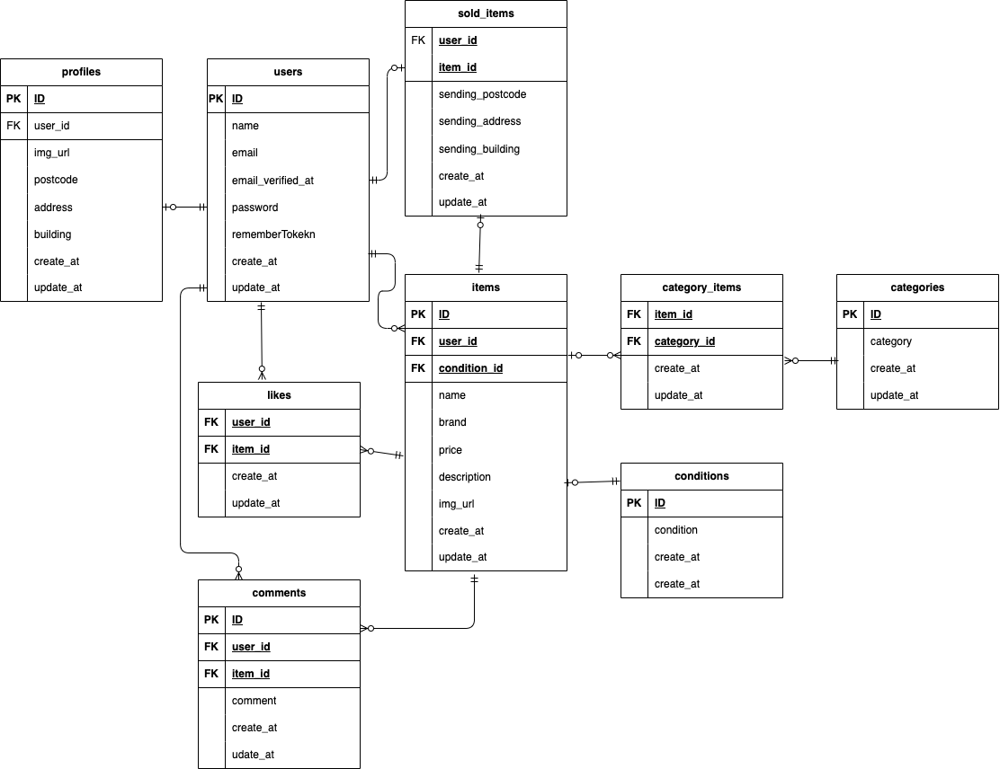

# フリマアプリ

## 環境構築

### Docker ビルド

1. git clone git@github.com:Arii-sa/mock-market.git
1. docker-compose up -d --build

&nbsp;&nbsp;&nbsp;&nbsp;&nbsp;※MySQL は、OS によって起動しない場合があるのでそれぞれの PC に合わせて docker-compose.yml ファイルを編集してください。

### Laravel 環境構築

1. docker-compose exec php bash
1. composer install
1. cp .env.example .env
1. .env ファイルの一部を以下のように編集

```
DB_HOST=mysql
DB_DATABASE=laravel_db
DB_USERNAME=laravel_user
DB_PASSWORD=laravel_pass
```

6. php artisan key:generate
1. php artisan migrate
1. php artisan db:seed

## メール認証機能の環境構築

本プロジェクトでは、**MailHog** を利用してメール送信・メール認証を確認できるようにしています。

### MailHog 起動

1. docker-compose.yml に MailHog サービスを追加

```
mailhog:
    image: mailhog/mailhog:v1.0.1
    container_name: mock-test-mailhog
    ports:
      - "1025:1025"
      - "8025:8025"
```

1. Docker を再起動

```bash
docker-compose up -d --build
```

1. .env ファイルの一部を以下のように変更

```
MAIL_MAILER=smtp
MAIL_HOST=mock-test-mailhog
MAIL_PORT=1025
MAIL_USERNAME=null
MAIL_PASSWORD=null
MAIL_ENCRYPTION=null
MAIL_FROM_ADDRESS="no-reply@example.com"
MAIL_FROM_NAME="${APP_NAME}"
```

## user のログイン用初期データ

- メールアドレス: ono@example.com
- パスワード: password1234

## 出品 user のログイン用初期データ

- メールアドレス: test@example.com
- パスワード: password123

## 使用技術

- MySQL 8.0.26
- PHP 8.1.33
- Laravel 8

## URL

- 環境開発: http://localhost/login
- phpMyAdmin: http://localhost:8080/
- mailhog: http://localhost:8025/

## ER 図



## PHPUnit を利用したテストに関して

1. データベース作成　以下のコマンド:

```
//テスト用データベースの作成
docker-compose exec mysql bash
mysql -u root -p
//パスワードはrootと入力
create database demo_test;
```

1. config ファイルの一部を以下のように変更

```
'mysql_test' => [
            'driver' => 'mysql',
            'url' => env('DATABASE_URL'),
            'host' => env('DB_HOST', '127.0.0.1'),
            'port' => env('DB_PORT', '3306'),
            'database' => 'demo_test',
            'username' => 'root',
            'password' => 'root',
            'unix_socket' => env('DB_SOCKET', ''),
            'charset' => 'utf8mb4',
            'collation' => 'utf8mb4_unicode_ci',
            'prefix' => '',
            'prefix_indexes' => true,
            'strict' => true,
            'engine' => null,
            'options' => extension_loaded('pdo_mysql') ? array_filter([
                PDO::MYSQL_ATTR_SSL_CA => env('MYSQL_ATTR_SSL_CA'),
            ]) : [],
        ],
```

1. テスト用.env ファイル作成

```
//.env.testingの作成
cp .env .env.testing
//.env.testingの編集　それぞれ以下のように変更
APP_ENV=test
APP_KEY=

DB_DATABASE=demo_test
DB_USERNAME=root
DB_PASSWORD=root
```

1. APP_KEY に新たなテスト用のアプリケーションキーを加えるために以下のコマンドを実行

```
php artisan key:generate --env=testing
```

1. テスト用テーブル作成

```
php artisan migrate --env=testing
```

1. phpunit を以下のように編集

```
<server name="DB_CONNECTION" value="mysql_test"/>
<server name="DB_DATABASE" value="demo_test"/>
```

## stripe 機能

1. Stripe アカウント作成

- Stripe にサインアップ

- 「テストモード」で動作確認用の API キー を取得
  公開用（STRIPE_KEY）
  秘密用（STRIPE_SECRET）

- API キーを.env に設定
  ※ STRIPE*SECRET（sk_test*...）は Git 管理しないでください

- Stripe PHP ライブラリをインストール

- config/services.php（必要な場合）
  'stripe' => [
  'key' => env('STRIPE_KEY'),
  'secret' => env('STRIPE_SECRET'),
  ],

1. 購入動作について

- コンビニ支払いとカード支払いのオプションがありますが、決済画面にてコンビニ支払いを選択しますと、レシートを印刷する画面に遷移します。そのため、カード支払いを成功させた場合に意図する画面遷移が行える想定です。

- 購入する際(カード選択)
  　カード番号　 4242 4242 4242 4242
